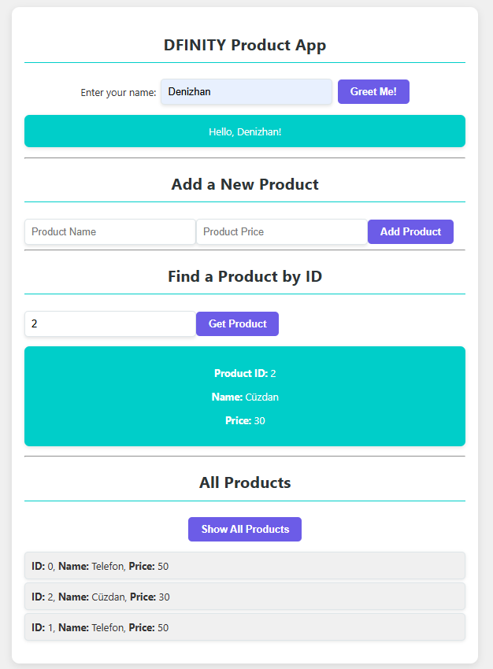

## Screenshots

<div style="display: flex; gap: 10px;">
    
    
</div>


# DFINITY Product App

A simple product management app built on the DFINITY Internet Computer using Motoko and React. This app allows users to add products, search for products by ID, and view a list of all products.

## Features

- **Add Product**: Add new products with a unique ID, name, and price.
- **Find Product by ID**: Retrieve product details by entering its unique ID.
- **Show All Products**: View a list of all added products.

## Technologies Used

- **Frontend**: React, HTML, CSS
- **Backend**: Motoko (for the DFINITY Internet Computer)
- **Styling**: SCSS
- **Deployment**: DFINITY Internet Computer (local replica for testing)

## Installation

To run this project locally, follow these steps:

1. **Clone the Repository**:
   Clone this repository to your local machine using the command:
   ```bash
   git clone https://github.com/denizhanMisirlioglu/dfinityProductApp.git
   cd dfinityProductApp

2. **Install Frontend Dependencies**:
  cd src/motoko_project_frontend
  npm install

3. **Start the DFINITY Internet Computer**:
  dfx start --background

4. **Deploy the Canisters**:
  dfx deploy

5. **Run the Frontend**:
  npm run dev
 
Enter your name: Get a personalized greeting.
Add a product: Enter the product's name and price.
Retrieve product details by ID or view all products added.


LICENSE

This project is licensed under the MIT License - see the LICENSE file for details.


---

